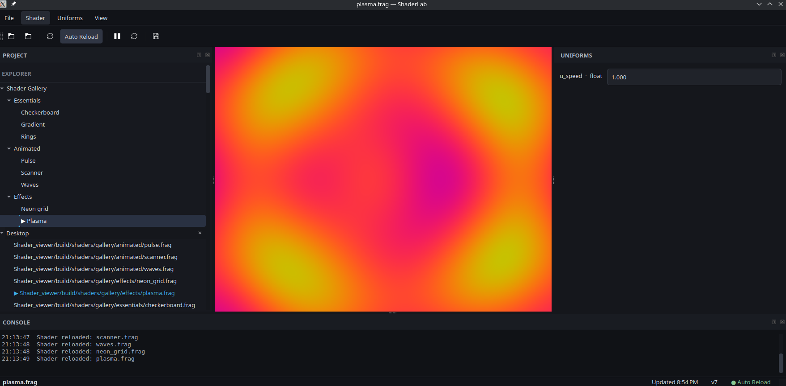

# ShaderLab

A lightweight desktop GLSL shader playground built with **C++, Qt 6 and OpenGL**.



ShaderLab is a desktop application for exploring, previewing and experimenting with GLSL shaders in real time. It combines live shader rendering with runtime controls, project management and a built-in collection of example shaders.

## Features

- Real-time GLSL shader rendering
- Built-in shader gallery
- Automatic shader reloading
- Runtime uniform controls
- Support for `float`, `int`, `vec2`, `vec3`, `vec4` and `sampler2D` uniforms
- Color controls for shader parameters
- Project and file explorer
- Shader compilation console
- Pause and reset shader animation
- Shader preset saving and loading
- Screenshot export
- Persistent workspace layout

## Shader Gallery

ShaderLab includes a collection of built-in shaders so the application can be explored immediately without loading external files.

### Essentials
- Gradient
- Checkerboard
- Rings

### Animated
- Pulse
- Scanner
- Waves

### Effects
- Plasma
- Neon Grid

## Tech Stack

- **C++20**
- **Qt 6**
- **OpenGL 3.3 Core**
- **GLSL**
- **CMake**
- **Ninja**

## Building

### Requirements

- C++20 compatible compiler
- Qt 6
- CMake 3.20+
- OpenGL 3.3+
- Ninja

### Linux

Clone the repository:

```bash
git clone https://github.com/tandospellman/shaderlab.git
cd shaderlab
```

Configure and build:

```bash
cmake -S . -B build -G Ninja
cmake --build build
```

Run:

```bash
./build/shaderlab
```

## About ShaderLab

ShaderLab began as a personal tool for learning and experimenting with GLSL and evolved into a desktop environment for shader development.

The project explores both graphics programming and desktop application development, including real-time rendering, shader compilation, runtime uniform reflection, file-system monitoring, application state persistence and UI design with Qt.

## Future Improvements

- Visual shader gallery thumbnails
- Integrated GLSL code editor
- Improved shader error diagnostics
- Additional built-in shaders
- Multiple render passes
- Expanded texture controls

## License

This project is currently provided for portfolio and educational purposes.
